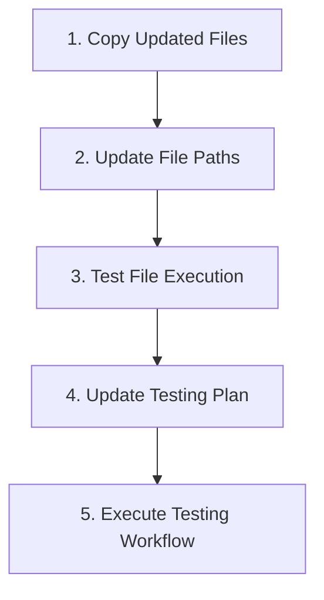
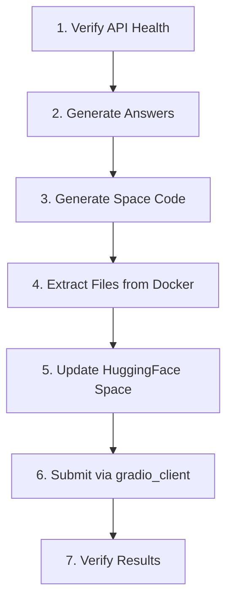

# GAIA Benchmark Testing and Submission Plan

This document outlines the plan for testing the GAIA agent with the official benchmark questions and submitting the results to the Hugging Face leaderboard.

## Current Status
- Docker container is running as "gaia-agent-container"
- Agent API is accessible at http://localhost:8000
- HuggingFace account set up with username "grasant" 
- Template Space duplicated with name "GAIA_A1"

## Implementation Plan



### Step 1: Copy Files from Playground to Current Workspace
We need to copy these files:
1. `test_with_official_api.py` → `tests/gaia/test_with_official_api.py`
2. `run_gaia_test.py` → `tests/gaia/run_gaia_test.py`
3. `generate_space_code.py` → `tests/gaia/generate_space_code.py`
4. `submit_to_leaderboard.py` → `tests/gaia/submit_to_leaderboard.py`

### Step 2: Update File Paths
The copied files contain paths like `/usr/src/app/tests/gaia/...` which may need to be updated based on your Docker configuration.

## Testing and Submission Process



### Phase 1: Local Testing and Answer Generation (Docker)
Use Docker to test your agent with the official GAIA benchmark questions:

**Step 1.1: Verify API Health with Single Question**
```bash
docker exec -it gaia-agent-container python /usr/src/app/tests/gaia/test_with_official_api.py --agent-url http://localhost:8000 --task-id <specific-task-id>
```

**Step 1.2: Generate Answers for All 20 Official Questions**
```bash
docker exec -it gaia-agent-container python /usr/src/app/tests/gaia/test_with_official_api.py --agent-url http://localhost:8000 --all
```

**Step 1.3: Generate Space Code**
```bash
docker exec -it gaia-agent-container python /usr/src/app/tests/gaia/generate_space_code.py
```

### Phase 2: Prepare for Submission

**Step 2.1: Extract Generated Files from Container**
```bash
docker cp gaia-agent-container:/usr/src/app/gaia_submission_answers.json ./gaia_submission_answers.json
docker cp gaia-agent-container:/usr/src/app/space_code.py ./space_code.py
```

**Step 2.2: Update Your HuggingFace Space**
1. Go to your duplicated Space: https://huggingface.co/spaces/grasant/GAIA_A1
2. Open the `app.py` file in the UI
3. Replace the entire content with your generated `space_code.py` content
4. Commit the changes

### Phase 3: Submit via gradio_client (Local Python)

**Option A: Submit via Python Script**
Create a file named `submit_gaia.py` with the following content:

```python
from gradio_client import Client
import os

# Initialize the client
client = Client("grasant/GAIA_A1")

# Check login status
print("Checking login status...")
login_status = client.predict(api_name="/_check_login_status")
print(f"Login status: {login_status}")

# Submit answers
print("Submitting answers to leaderboard...")
result = client.predict(api_name="/run_and_submit_all")

# Print results
print("\nSubmission results:")
print(f"Status: {result[0]}")
print("\nDetailed results:")
if result[1] and 'data' in result[1] and result[1]['data']:
    for row in result[1]['data']:
        print(f"Question: {row[1]}")
        print(f"Answer: {row[2]}")
        print(f"Correct: {row[3]}")
        print("---")
```

Run the submission script:
```bash
python submit_gaia.py
```

**Option B: Using Built-in Submit Script**
Alternatively, you can use the submit_to_leaderboard.py script:

```bash
python tests/gaia/submit_to_leaderboard.py --username grasant --space-name GAIA_A1
```

### Phase 4: Verify Results

1. Check the output from the submission script
2. Visit the GAIA leaderboard to see your submission: https://huggingface.co/spaces/gaia-benchmark/leaderboard

## Key Differences in the Updated Testing Files

1. **test_with_official_api.py (New File)**
   - Gets questions directly from the official GAIA API at "https://agents-course-unit4-scoring.hf.space"
   - Supports testing with all 20 official questions (not just 6 sample questions)
   - Has functionality to get a random question, all questions, or a specific question by task ID
   - Formats results in the correct submission-ready format
   
2. **run_gaia_test.py (Updated)**
   - References the new testing script instead of the old one
   - Uses different parameters (`--agent-url` instead of `--base-url`)
   - Provides a more streamlined testing workflow

## Troubleshooting

### API Connection Issues
- **Symptom**: Cannot connect to agent API or health check fails
- **Solution**: Verify the container is running with `docker ps` and check logs with `docker logs gaia-agent-container`

### Answer Generation Issues
- **Symptom**: Validation errors in generated answers
- **Solution**: Check that your agent returns properly formatted JSON responses with all required fields

### Authentication Issues
- **Symptom**: "Not logged in" message persists
- **Solution**: 
  1. Ensure you're logged in to HuggingFace in your browser
  2. Try using a HuggingFace API token (generate at https://huggingface.co/settings/tokens)
  3. Add the token to your environment: `export HUGGINGFACE_TOKEN=your_token_here`

### Space Code Issues
- **Symptom**: Space doesn't start or errors in Space console
- **Solution**: 
  1. Check for syntax errors in the generated code
  2. Ensure the Space visibility is set to "Public"
  3. Try rebuilding the Space from the HuggingFace UI

### Submission Failures
- **Symptom**: Error messages during submission
- **Solution**:
  1. Verify your Space is public
  2. Check your internet connection
  3. Try the alternative submission method (UI vs script)